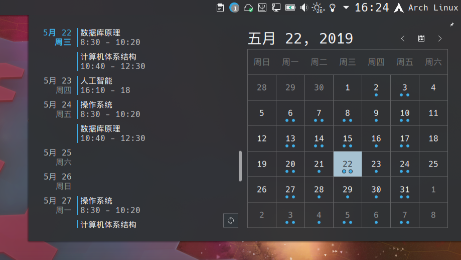
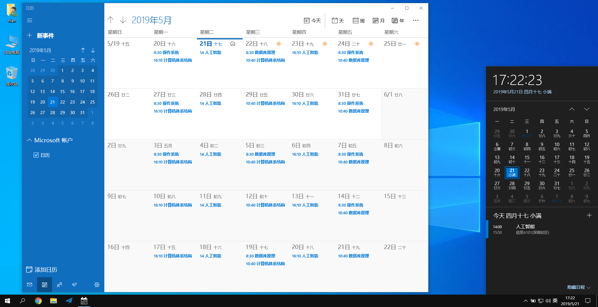
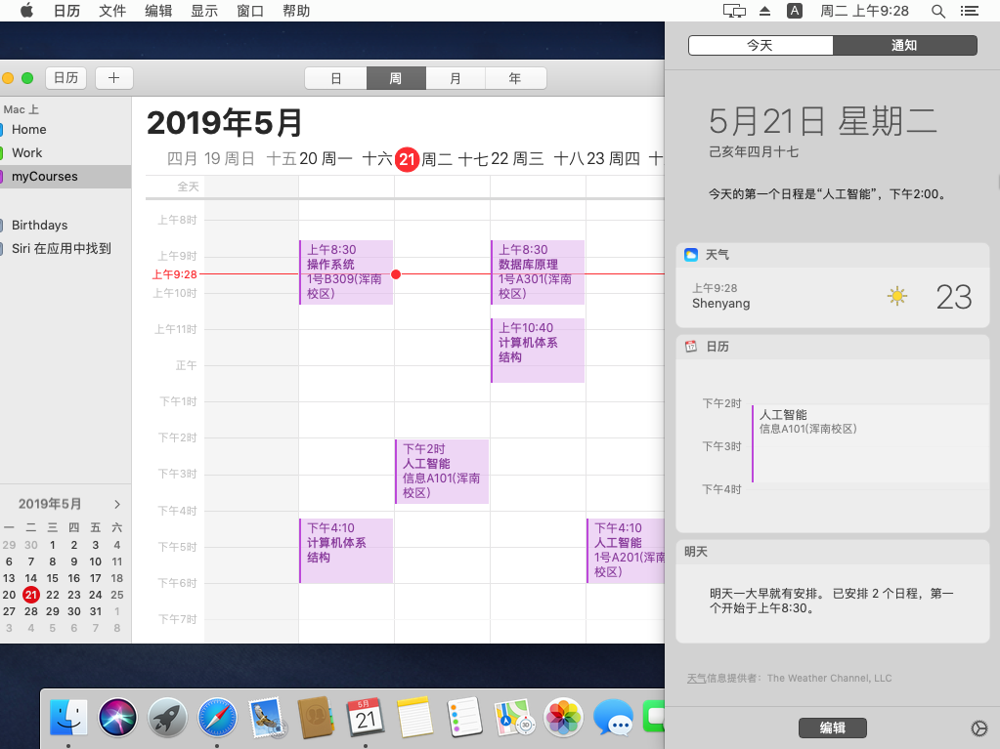

# getMyCourses

从 SUEP 教务系统获取自己的课程表，并生成可导入日历的 `.ics` 文件。

## 使用方法

- 下载 [Release](https://github.com/TeamSUEP/getMyCourses/releases/latest) 后在命令行环境下运行。
- 按提示通过树维教务系统或统一认证登录，程序自动抓取课程并在当前目录生成 `myCourses.ics`。
- 打开 `myCourses.ics` 文件，系统会自动调用关联程序进行导入。

## 参考信息

- 通过树维教务系统登录获取课程表的具体请求过程：[NEU 新版教务处课程表.md](https://gist.github.com/whoisnian/32b832bd55978fefa042d7c76f9d76c3)
- iCalendar 格式介绍：[维基百科：ICalendar](https://zh.wikipedia.org/wiki/ICalendar)
- Google 日历帮助：[创建或编辑 iCalendar 文件](https://support.google.com/calendar/answer/37118?hl=zh-Hans)
- MiaoTony 师傅：[如何将 .ics 日历文件导入日历？](https://miaotony.xyz/NUAA_ClassSchedule/HowToImport.html)

## 注意

- 生成 `.ics` 文件过程中会在命令行输出获取到的课程，请检查无误后再进行导入。
- 当前已测试可成功导入 `.ics` 文件的日历：
  - [Google 日历](https://support.google.com/calendar/answer/37118?hl=zh-Hans)
  - [Outlook 日历](https://support.microsoft.com/zh-cn/office/%E5%B0%86%E6%97%A5%E5%8E%86%E5%AF%BC%E5%85%A5-outlook-8e8364e1-400e-4c0f-a573-fe76b5a2d379)
  - [Mac 系统日历](https://support.apple.com/zh-cn/guide/calendar/icl1023/mac)
  - Win10 UWP 系统日历
- Win10 UWP 日历缺少批量删除功能，可以关联 Outlook 帐户后使用 Outlook 帐户新建一个日历单独用于存储课程表。

## 效果图

